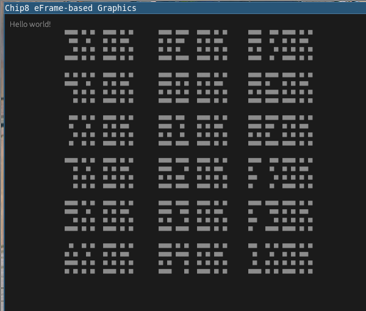

# ChipRust8

## What is it?

[CHIP-8](https://en.wikipedia.org/wiki/CHIP-8) is an interpreted bytecode, originally for the COSMAC VIP.  It's also a 
fan favorite for learning to write VMs and interpreters.  This is yet another CHIP-8 interpreter, written in Rust.

## Why is it?

I had a week off work between Christmas and New Year and wanted to see how far I could get.  I also wanted to do some more
substantive Rust programming, instead of just doing some puzzles.

## Technical

### Running It:
* `git clone`
* `cargo run -- -r <chip8rom.ch8>`

Run with `-h` for help.

### Goals
* **Extendability**.  There are a number of variants of CHIP-8, and while I don't have implementations for 
each variant, the system is designed in such a way that e.g. implementing a larger screen should be trivial.
* **Modularity**. I have chosen to use `egui` (via `eframe`) for this initial implentation.  However, any other graphics
framework could be used in its place, by writing a harness that can poll my `GraphicsAdapter`.
* **Code Quality**. I wanted to write something with a strong design, implemented well.
* **Testing**. Enough said.

## Status
### Successes
* The [CHIP-8 Test ROM] (https://github.com/corax89/chip8-test-rom) and IBM test ROM both pass
* Many demo ROMs work well
* Initial support for keyboard I/O, with a few kinks to work out.

### To-Dos
- [ ] Better output formatting, instead of Unicode filled-boxes in a monospaced font
- [ ] Fix I/O. Currently causes stuttering on some games
- [ ] More testing.
  - [ ] Finish testing each instruction
  - [ ] Add testing for decoding
- [ ] Add docs.
